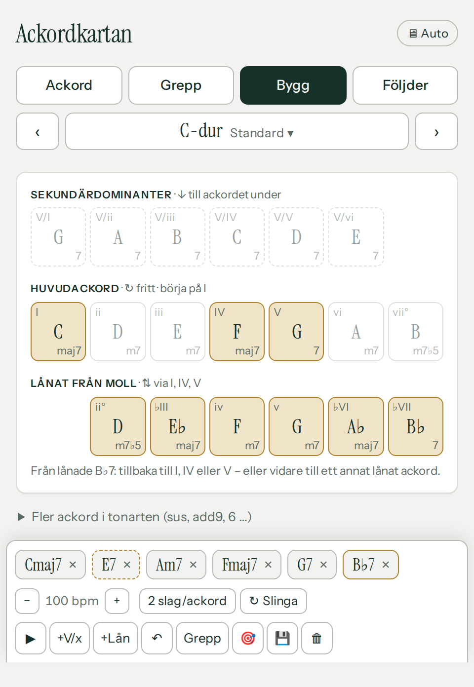
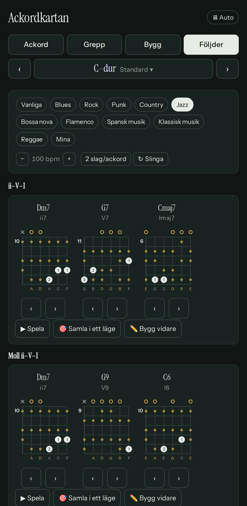
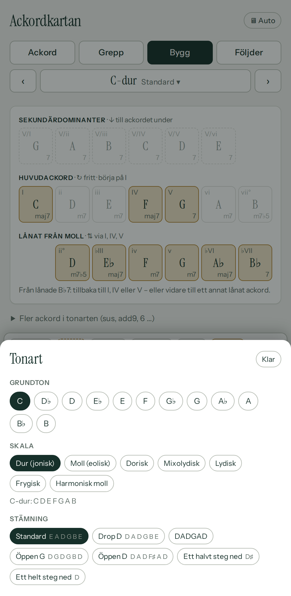

# Ackordkartan

En app som genererar gitarrgrepp i en vald tonart — med fokus på **öppna klanger högt upp på halsen**, inte bara barrégrepp i första läget. Kärnan (all teori, all greppsökning, hela UI:t) är en enfilsapp i [index.html](index.html) — ingen byggkedja, inga beroenden, praktiskt taget inget ackordbibliotek (bara de klassiska öppna skolboksgreppen), allt körs i webbläsaren.

## Skärmdumpar

| Ackord | Grepp | Bygg |
| --- | --- | --- |
| [](screenshots/ackord.png) | [](screenshots/grepp.png) | [](screenshots/bygg.png) |

| Följder (mörkt läge) | Tonart |
| --- | --- |
| [](screenshots/foljder-dark.png) | [](screenshots/tonart.png) |

## Så fungerar greppsökningen

1. Varje sträng får kandidatvärdena `mute`, `0` (öppen) eller vilket band 1–15 vars tonklass ingår i ackordet.
2. Djupet-först-sökning över de sex strängarna, med beskärning på spännvidd (max 5 band).
3. Filter på det som faktiskt går att spela:
   - alla nödvändiga toner måste finnas (kvinten får utelämnas)
   - minst fyra klingande strängar, max ett dämpat mellanrum
   - max fyra unika band = fyra fingrar
   - barrégiltighet: ligger två toner på samma band måste strängarna emellan greppas högre
4. Poängsättning som premierar öppna strängar och högt läge, och straffar spännvidd, barré och antal fingrar.

Steg 4 är hela poängen: filtrera på "minst en öppen sträng" + lägsta läge band 5 så återstår bara saker som Dsus2-formen flyttad upp, Cadd9 kring band 7, m7-grepp med öppen h- och e-sträng.

## Funktioner

- **Fyra flikar**: **Ackord** (ackorden i tonarten), **Grepp** (halsdiagram, filter, greppkort), **Bygg** (ackordkartan och en byggbricka för egna följder) och **Följder** (bibliotek med vanliga följder, tio stilar och dina sparade)
- **En gemensam tonartsrad** under flikarna: ‹ › flyttar ett halvt steg, mittknappen öppnar ett ark med grundton, sju skalor (dur, moll, dorisk, mixolydisk, lydisk, frygisk, harmonisk moll) och sju stämningar (standard, drop D, DADGAD, öppen G, öppen D, ett halvt/helt steg ned)
- **Stavning efter tonart**: B♭ i F-dur, E♭maj7 som ♭III i C, D♭-dur men C♯-moll
- **Ackord**: treklanger och septimackord per skalsteg med klassiska öppna grundgrepp; färgade varianter (sus2, sus4, 6, add9, 9, m9 …) som håller sig i tonarten fälls ut per steg
- **Grepp**: välj skalsteg och variant direkt i fliken; grepp med grundtonen i basen först, grupperade efter läge (band 0–4 / 5–9 / 10+), omvändningar hopfällda; valfri slash-bas; skalans toner som små prickar runt greppet
- **Ackordkartan** (inspirerad av chord_files *Progressions*): sekundärdominanter, huvudackord och lånade ackord från parallelltonarten i en kolumn per skalsteg; efter varje ackord markeras de naturliga nästa stegen
- **Byggbrickan**: följden som ackordbrickor, **+V/x** och **+Lån** kryddar den enligt kartans regler, ↶ ångrar, 🎯 *Samla i ett läge* väljer grepp som minimerar handförflyttningen, 💾 sparar; byter du tonart följer följden med
- **Följder**: fem vanliga följder per tonart och tio stilar (blues, rock, punk, country, jazz, bossa nova, flamenco, spansk musik, klassisk musik, reggae), med romerska siffror, bläddringsbara grepp och *Bygg vidare* till byggbrickan
- **Uppspelning** med Karplus-Strong-syntes via Web Audio (inget ljudmaterial att ladda): tempo 40–200 bpm, 1/2/4 slag per ackord, slinga, och markering av ackordet som spelas
- **Minns var du var**: flik, tonart, skala, stämning, filter, valt ackord, byggarens följd och tempo sparas i webbläsaren
- Följer systemets ljusa/mörka läge (eller välj själv)
- Installerbar som app på Android/Chrome (PWA) och håller skärmen vaken medan appen är öppen

## Köra lokalt

```bash
python3 -m http.server 8000
# öppna http://localhost:8000
```

Eller öppna `index.html` direkt i webbläsaren — den behöver ingen server.

## GitHub Pages

`index.html` ligger i roten, så det räcker att slå på Pages under **Settings → Pages → Deploy from a branch → main / (root)**.

## Kod

All teori, sökning och rendering ligger i `index.html`:

| Del | Vad den gör |
| --- | --- |
| `TUNINGS`, `MODES`, `QUALITIES` | teoritabeller, ackordkvaliteter slås upp på intervallmängd |
| `buildChords()` | staplar terser inom skalan och lägger till färgade varianter som ryms |
| `findVoicings()` | sökningen och poängsättningen ovan |
| `fingering()`, `voicingFromFrets()` | finger 1–4 efter bandordning; bygger ett grepp baklänges från sparade band |
| `diagram()`, `drawNeck()` | SVG-rendering av greppdiagram respektive halsdiagram |
| `keyLetter()`, `spell()`, `chordPcName()` | stavning efter tonart (en bokstav per skalsteg) |
| `renderRoots()`, `renderKeySheet()`, `setRoot()`/`setMode()`/`setTuning()` | tonartsraden och tonartsarket |
| `renderGreppChords()`, `renderVoicings()` | Grepp-fliken: ackordval och greppkort grupperade efter läge |
| `progMap()`, `renderMap()`, `spiceSec()`/`spiceBor()` | ackordkartan och Krydda-reglerna |
| `renderBuilder()`, `builderEdit()`, `transposeBuilder()` | byggbrickan: följden, ångra, transponering |
| `progRow()`, `voicingRow()`, `renderLibrary()` | rader med greppdiagram och biblioteket i Följder (`STYLE_PROGS` för stilarna) |
| `gatherIdx()` | *Samla i ett läge*: Viterbi över greppistorna |
| `pluck()`, `strum()`, `togglePlayback()` | Karplus-Strong och uppspelning av följder |
| `saveState()`, `loadState()` | minnet mellan besöken |

Utöver `index.html` finns ett litet PWA-skal som gör appen installerbar (Chrome/Android):

| Fil | Vad den gör |
| --- | --- |
| `manifest.json`, `sw.js` | app-manifest respektive service worker (cache:ar appskalet, stale-while-revalidate) |
| `icons/` | app-ikonen i alla storlekar manifestet/Apple/favicon behöver |
| `icons.js`, `cdp.js` | dev-tid-verktyg som genererar `icons/`-filerna från en enda mark (`node icons.js`) — laddas aldrig av appen själv |

## Licens

MIT
