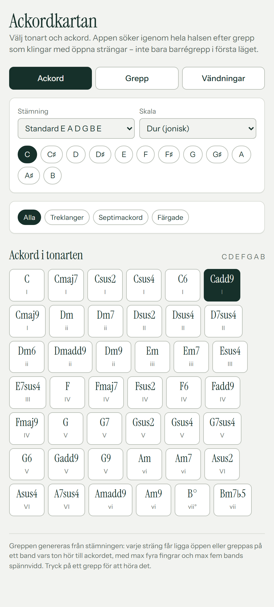
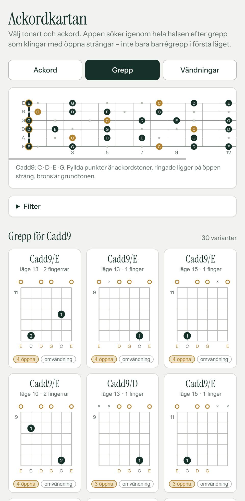
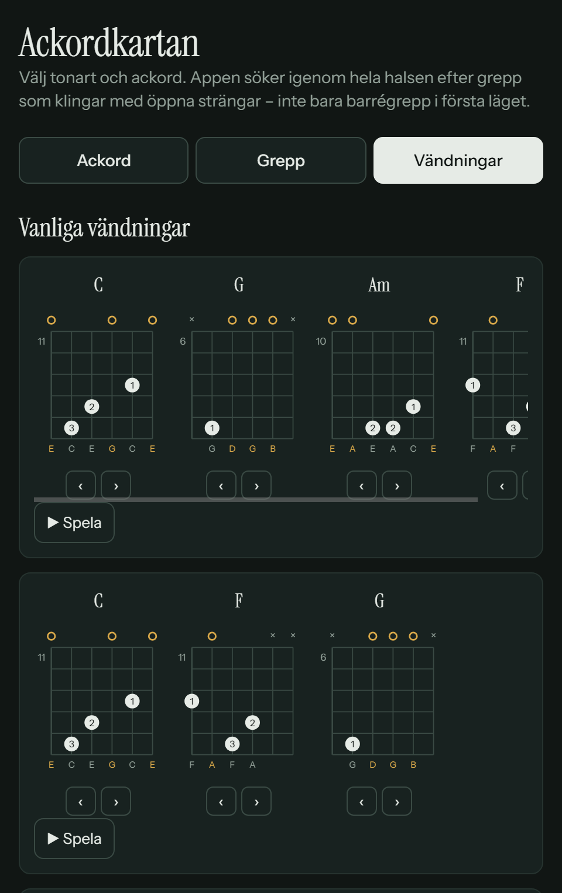

# Ackordkartan

En app som genererar gitarrgrepp i en vald tonart — med fokus på **öppna klanger högt upp på halsen**, inte bara barrégrepp i första läget. Kärnan (all teori, all greppsökning, hela UI:t) är en enfilsapp i [index.html](index.html) — ingen byggkedja, inga beroenden, inget ackordbibliotek, allt körs i webbläsaren.

## Skärmdumpar

| Ackord | Grepp | Ackordföljder |
| --- | --- | --- |
| [](screenshots/ackord.png) | [](screenshots/grepp.png) | [](screenshots/vandningar-dark.png) |

## Så fungerar greppsökningen

1. Varje sträng får kandidatvärdena `mute`, `0` (öppen) eller vilket band 1–15 vars tonklass ingår i ackordet.
2. Djupet-först-sökning över de sex strängarna, med beskärning på spännvidd (max 5 band).
3. Filter på det som faktiskt går att spela:
   - alla nödvändiga toner måste finnas (kvinten får utelämnas)
   - minst fyra klingande strängar, max ett dämpat mellanrum
   - max fyra unika band = fyra fingrar
   - barrégiltighet: ligger två toner på samma band måste strängarna emellan greppas högre
4. Poängsättning som premierar öppna strängar och högt läge, och straffar spännvidd, barré och antal fingrar.

Steg 4 är hela poängen: filtrera på "minst en öppen sträng" + lägsta läge band 5 så återstår bara saker som Dsus2-formen flyttad upp, Cadd9 kring band 7, m7-grepp med öppen h- och e-sträng.

## Funktioner

- Sju skalor: dur, moll, dorisk, mixolydisk, lydisk, frygisk, harmonisk moll
- Treklanger, septimackord och färgade ackord (sus2, sus4, 6, add9, 9, m9 …) filtrerade till det som håller sig i tonarten
- Alternativa stämningar: standard, drop D, DADGAD, öppen G, öppen D, nedstämt ett halvt/helt steg
- Tre flikar: **Ackord** (tonart/skala/ackordval), **Grepp** (halsdiagram, filter, greppkort) och **Ackordföljder**
- Halsdiagram som visar ackordstonerna mot skalan över 15 band
- Ackordföljder: fem vanliga ackordföljder per tonart med bläddringsbara grepp per ackord, plus en byggare för egna ackordföljder som sparas i webbläsaren (låsta till de exakta grepp du valde)
- Uppspelning med Karplus-Strong-syntes via Web Audio, inget ljudmaterial att ladda
- Följer systemets ljusa/mörka läge
- Installerbar som app på Android/Chrome (PWA) och håller skärmen vaken medan appen är öppen

## Köra lokalt

```bash
python3 -m http.server 8000
# öppna http://localhost:8000
```

Eller öppna `index.html` direkt i webbläsaren — den behöver ingen server.

## GitHub Pages

`index.html` ligger i roten, så det räcker att slå på Pages under **Settings → Pages → Deploy from a branch → main / (root)**.

## Kod

All teori, sökning och rendering ligger i `index.html`:

| Del | Vad den gör |
| --- | --- |
| `TUNINGS`, `MODES`, `QUALITIES` | teoritabeller, ackordkvaliteter slås upp på intervallmängd |
| `buildChords()` | staplar terser inom skalan och lägger till färgade varianter som ryms |
| `findVoicings()` | sökningen och poängsättningen ovan |
| `fingering()`, `voicingFromFrets()` | finger 1–4 efter bandordning; bygger ett grepp baklänges från sparade band |
| `diagram()`, `drawNeck()` | SVG-rendering av greppdiagram respektive halsdiagram |
| `progRow()`, `renderBuiltinProgs()`, `renderCustomProgs()` | Ackordföljder-fliken: delad radrendering, de fem inbyggda följderna, sparade/byggda egna |
| `pluck()`, `strum()` | Karplus-Strong |

Utöver `index.html` finns ett litet PWA-skal som gör appen installerbar (Chrome/Android):

| Fil | Vad den gör |
| --- | --- |
| `manifest.json`, `sw.js` | app-manifest respektive service worker (cache:ar appskalet, stale-while-revalidate) |
| `icons/` | app-ikonen i alla storlekar manifestet/Apple/favicon behöver |
| `icons.js`, `cdp.js` | dev-tid-verktyg som genererar `icons/`-filerna från en enda mark (`node icons.js`) — laddas aldrig av appen själv |

## Licens

MIT
